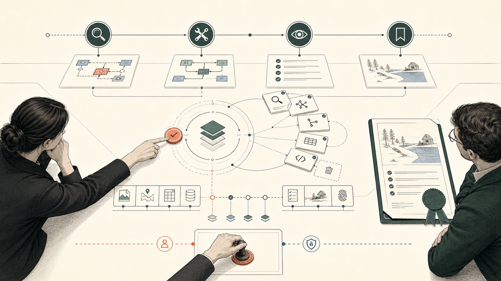

# Captain's Table



Captain's Table turns a fragile group decision into a shared, inspectable workflow between a human and ChatGPT—without giving the agent authority the human never granted.

**[Open the live demo](https://captains-table-webmcp-1017459622661.us-east1.run.app/)**

**[Watch the 99-second demo](https://youtu.be/4VA0pn55vfU)**

## The demo in 90 seconds

Eight people are meeting for an offsite. The plan looks settled, but two required attendees do not arrive until 11:40—and the roadmap session starts at 09:30.

The organizer asks ChatGPT:

> Find the most important conflict in this offsite plan, compare repairs, and select the arrival-safe option.

ChatGPT does not scrape the page or guess what its controls mean. Through WebMCP, it follows the same live decision workflow the organizer can see:

1. It inspects the plan and identifies the attendance conflict.
2. It diagnoses which constraints actually matter.
3. It compares viable repairs, including their schedule, attendance, and budget effects.
4. It selects the 12:15 roadmap session: all 8 attendees can participate and the plan totals $7,380.
5. It prepares that exact plan for review.

Then it stops.

Only the human can authorize the exact plan on the page. There is deliberately no `authorize_plan` tool. Once the organizer approves plan `04C2F029`, ChatGPT can execute it exactly once and produce receipt `CT-79ECA1`. Reloading the page recovers the same receipt instead of creating a second reservation.

That is the full story: the agent supplies leverage, the interface preserves authority, and the system leaves durable proof of what happened.

## Try it

1. Open the **[production demo](https://captains-table-webmcp-1017459622661.us-east1.run.app/)** in a WebMCP-enabled ChatGPT browser.
2. Ask:

   > Find the most important conflict in this offsite plan, compare repairs, and select the arrival-safe option.

3. Watch the visible workflow advance as ChatGPT inspects, diagnoses, compares, and selects.
4. Review the proposed repair and authorize it on the page.
5. Ask ChatGPT to create the reservation.
6. Reload the page to see the durable receipt recovered from production storage.

Without WebMCP, the application enters an explicit Manual mode. The complete human workflow remains usable.

## Why this needs WebMCP

This is not a chatbot placed beside a form. The human and the agent operate one live decision surface.

- **Shared state:** ChatGPT works from the current server-backed plan, not a stale transcription of the page.
- **Purpose-built actions:** tools express decision steps such as diagnose, compare, and select—not low-level clicks.
- **A changing capability surface:** each completed step reveals only the next valid actions.
- **A hard authority boundary:** the agent may prepare and execute, but only a human can authorize the exact plan.
- **Visible consequences:** every agent action updates the same interface the human is reviewing.

## What the proof shows

The production journey advances through six revision-bound capability epochs:

| Stage | Capability epoch | Agent action |
| --- | --- | --- |
| R1 | `94CBFBDC` | Inspect the decision |
| R2 | `3E4C671A` | Diagnose the conflict |
| R3 | `81C06189` | Compare repairs |
| R4 | `2E089520` | Select the repair and wait for the human |
| R5 | `BB341B1D` | Prepare the authorized plan for execution |
| R6 | `19C3FFBF` | Confirm the durable outcome |

Each tool set is bound to the workflow revision that issued it. If an obsolete callback is retained after the page requests removal, the server rejects it rather than applying it to newer state.

The verified native-host run demonstrated:

- the expected tool set at every revision;
- page-only authorization of the exact plan hash;
- zero accepted authorization bypasses;
- zero accepted stale mutations;
- zero duplicate executions; and
- recovery of the original receipt after reload.

Chrome 151 separately proves page-level WebMCP enablement for the production origin. Native host discovery and invocation were verified in ChatGPT's built-in browser. Resolution of `registerTool()` is never treated as proof that a host discovered a tool or acknowledged its removal.

## How it works

ChatGPT is the external agent. The page exposes state-aware tools through the WebMCP imperative API, while FastAPI validates every transition against server state. Firestore provides production persistence; Cloud Run serves the application.

The workflow tools appear one stage at a time:

1. `inspect_decision`
2. `diagnose_plan`
3. `compare_repairs`
4. `select_repair`
5. `prepare_authorization`
6. `execute_authorized_plan`

The diagnostic tool `report_observed_capabilities` lets the agent report what it actually sees, keeping agent observation distinct from page-side registration telemetry.

There is no embedded OpenAI Agents SDK, Gemini or Google ADK runtime, or standalone MCP server. ChatGPT owns planning and invocation; the application owns workflow state, validation, authorization, persistence, and evidence.

## Reliability and testing

The Python 3.13 suite passes **20 tests**, including **13 Playwright browser cases** covering the complete lifecycle: dynamic tool replacement, page-only authorization, stale-handle rejection, idempotent execution, receipt recovery, fallback modes, and visible stale-state recovery.

The deployed production smoke check passed with:

- HTTP 200;
- zero browser console errors;
- three default proof signals;
- technical evidence collapsed by default; and
- no Firestore workflow mutation during the check.

The workflow-first interface also completed a final 40/40 Impeccable static review.

## Run locally

```bash
python3 -m venv .venv
.venv/bin/pip install -r requirements.txt
.venv/bin/uvicorn app.main:app --reload
```

Open `http://127.0.0.1:8000`.

## Run the test suite

```bash
.venv/bin/python -m pip install -r requirements-dev.txt
.venv/bin/playwright install chromium
.venv/bin/python -m pytest -q
```

## Evidence and documentation

- [Host verification runbook](docs/webmcp-host-verification-runbook.md)
- [Protocol observations](docs/protocol-observations.md)
- [Interaction design](docs/interaction-design.md)
- [Engineering plan](docs/engineering-plan.md)
- [Google Cloud deployment guide](docs/deploy-google-cloud.md)
- [Protocol maintainer feedback](docs/protocol-maintainer-feedback.md)

Captain's Table was designed and built as a new project during the WebMCP Challenge. The repository contains the application, tests, deployment configuration, and verification evidence used for the submitted demo.
